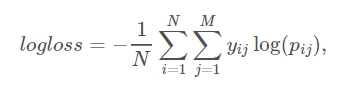

# naive bayes for SanFrancisco Crime Classfication

## Brief introduction
train a naive bayes model to predict the probability of SanFrancisco Crime.

data_analysis.py includes data preprocessing of training data and test data. 

baseline.py includes construct a baseline model of naive bayes.

logistic_regression_4_test.py uses the model trained before to predict the label of the test data.

save_result.py use the feature engineering and the model which have been trained to predict the probability of each crime, and save it with the format same as the sampleSubmission.py 

Submissions are evaluated using the multi-class logarithmic loss.
 

## late submission
the score of our model is 2.58436, about top40% of the leadership, which is not good enough. Maybe after better feature engineering and feature combination we can get lower score and improve the ranking.